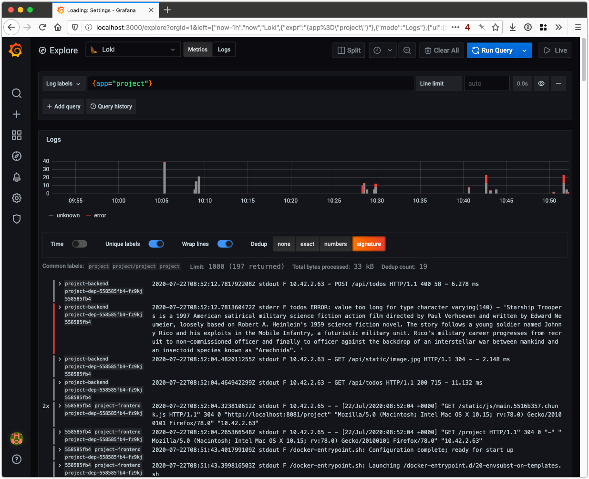

# Solving the DevOps with Kubernetes MOOC

This repo contains my solutions for the exercises of <https://devopswithkubernetes.com/>.

## Solutions for Part 1

| exercise | solution in subfolder        |
| -------- | ---------------------------- |
| 1.01     | `hashgenerator`              |
| 1.02     | `project`                    |
| 1.03     | `hashgenerator`              |
| 1.04     | `project`                    |
| 1.05     | `project`                    |
| 1.06     | `project`                    |
| 1.07     | `hashgenerator`              |
| 1.08     | `project`                    |
| 1.09     | `hashgenerator` & `pingpong` |
| 1.10     | `hashgenerator`              |
| 1.11     | `hashgenerator`              |
| 1.12     | `project`                    |
| 1.13     | `project`                    |

Against [better judgement](https://vsupalov.com/docker-latest-tag/) I used the "latest" tag for some assignments and Kubernetes `yaml` configurations. That's why some solutions can't be played through again, because the automatically built Image at Docker Hub doesn't match the step of the solution anymore. This is especially true for the main application. The project on the other hand is logically tagged.

## Solutions for Part 2

_The solution for exercises are based on each other. For this reason, not all of them are documented here._

### Deploying Solution for Ex. 2.03

```sh
# Create ping/pong app with namespace
$ kubectl create namespace pingpong
namespace/pingpong created
$ kubectl apply -f pingpong/manifests/
deployment.apps/pingpong-dep created
ingress.extensions/pingpong-ingress created
service/pingpong-svc created
# test
$ curl -s http://localhost:8081/pingpong
{"counter":1}
# Create main app in namespace that fetches ping/pongs and prints uuid every 5secs
$ kubectl create namespace hashgenerator
namespace/hashgenerator created
$ kubectl apply -f hashgenerator/manifests/
deployment.apps/hashgenerator-dep created
ingress.extensions/hashgenerator-ingress created
service/hashgenerator-svc created
# test
$ curl -s http://localhost:8081/pingpong
{"counter":2}
$ curl -s http://localhost:8081/
2020-07-17T11:44:52.631Z: 4bdeb719-73cb-482f-b66c-40d04d0d880d<br> 2
# what's in the namespaces?
$ kubens pingpong
Context "k3s-default" modified.
Active namespace is "pingpong".
$ kubectl get all
NAME                                READY   STATUS    RESTARTS   AGE
pod/pingpong-dep-777dbbd675-5kvrr   1/1     Running   0          3m49s

NAME                   TYPE        CLUSTER-IP     EXTERNAL-IP   PORT(S)    AGE
service/pingpong-svc   ClusterIP   10.43.219.90   <none>        6789/TCP   3m49s

NAME                           READY   UP-TO-DATE   AVAILABLE   AGE
deployment.apps/pingpong-dep   1/1     1            1           3m49s

NAME                                      DESIRED   CURRENT   READY   AGE
replicaset.apps/pingpong-dep-777dbbd675   1         1         1       3m49s
$ kubens hashgenerator
Context "k3s-default" modified.
Active namespace is "hashgenerator".
$ kubectl get all
NAME                                     READY   STATUS    RESTARTS   AGE
pod/hashgenerator-dep-66c9cc599d-wgkzg   2/2     Running   0          2m31s

NAME                        TYPE        CLUSTER-IP      EXTERNAL-IP   PORT(S)             AGE
service/hashgenerator-svc   ClusterIP   10.43.228.139   <none>        3001/TCP,2345/TCP   2m31s

NAME                                READY   UP-TO-DATE   AVAILABLE   AGE
deployment.apps/hashgenerator-dep   1/1     1            1           2m31s

NAME                                           DESIRED   CURRENT   READY   AGE
replicaset.apps/hashgenerator-dep-66c9cc599d   1         1         1       2m31s
```

### Exercise 2.05 ConfigMaps for `hashgenerator-server` aka main application

```sh
$ kubectl config set-context --current --namespace=hashgenerator
# Create ConfigMap from `hashgenerator-env-file.properties`
$ cat hashgenerator/manifests/hashgenerator-env-file.properties
SERVER_PORT=3001
GENERATOR_PORT=3002
HASHGENERATOR_URL=http://hashgenerator-svc:2345/
PINGPONG_URL=http://pingpong-svc.pingpong:6789/pingpong
MESSAGE=Hello%
$ kubectl create configmap hashgenerator-config-env-file --from-env-file hashgenerator/manifests/hashgenerator-env-file.properties
configmap/hashgenerator-config-env-file created
# It's live
$ curl -s http://localhost:8081
Hello<br> 2020-07-17T17:25:59.300Z: 14c4d2ff-25f2-4b45-86b8-4b7e3b80b435<br> 13
```

### Exercise 2.06

This spins up two pods. One Deployment with the ping/pong app and one StatefulSet with a PostgreSQL database container. During the creation of the database pod, the very very complex schema gets seeded. The database password is stored as as SealedSecret.

```sh
$ kubectl apply -f pingpong/manifests/
deployment.apps/pingpong-dep created
ingress.extensions/pingpong-ingress created
sealedsecret.bitnami.com/postgres-pw created
service/pingpong-svc created
service/postgres-pingpong-svc created
configmap/postgres-pingpong-seed created
statefulset.apps/postgres-pingpong-stateful created
$ curl -s http://localhost:8081/pingpong
{"counter":4}%
$ kubectl logs -f pingpong-dep-6bcb74f875-w5r72 pingpong

> pingpong@1.0.0 start /app
> node server.js

Writing to txt is disabled
NEVER log a db password to stdin: 'passw0rd'
Server started on: 3000
added a new ping to db
added a new ping to db
added a new ping to db
```

### Exercise 2.07

The state of the todo application gets stored in a PostgreSQL database. The app hooked up via [Sequelize](https://github.com/sequelize/sequelize). The table get created based on the [Task model](https://github.com/movd/devopswithkubernetes/blob/2229fc1779d08d97d4168b44536a96c599a6882c/project/backend/src/models/task.ts). For deployment the db connection parameter and password are stored and read from `secret.yaml`. This time around I'm not using SealedSecret. Only the backend and the deployment setup where changed.

<table>
<tr>
<td width="60%">
<pre lang="sh">
$ kubectl apply -f project/manifests/
deployment.apps/project-dep created
ingress.extensions/project-ingress-frontend created
ingress.extensions/project-ingress-api-static created
persistentvolume/project-pv created
persistentvolumeclaim/project-claim created
secret/postgres-pw-url created
service/project-svc created
service/postgres-project-svc created
statefulset.apps/postgres-project-stateful created
</pre>
</td>
<td width="30%">
<code>http://localhost:8081/project</code><br>
</td>
</tr> 
</table>

### Exercise 2.08

I followed the [steps in the course notes](https://devopswithkubernetes.com/part2/#monitoring) and installed Grafana and Loki via Helm. I added request logging via [morgan](https://github.com/expressjs/morgan) to my project application.

```sh
$ kubectl apply -f project/manifests/
deployment.apps/project-dep created
ingress.extensions/project-ingress-frontend created
ingress.extensions/project-ingress-api-static created
# ...just like in the exercise before
```

Grafana dashboard:

```sh
$ kubectl port-forward prometheus-operator-1595404775-grafana-7964b4fb7d-4hflq 3000
Forwarding from 127.0.0.1:3000 -> 3000
Forwarding from [::1]:3000 -> 3000
Handling connection for 3000
```


